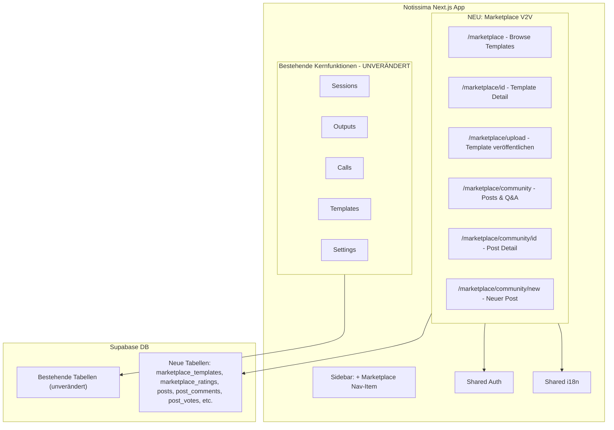

# Voice2Value Migration nach Notissima

## Bestätigung: Kein Risiko für Kernfunktionen

Korrekt — V2V wird als **eigenständiger Bereich** unter `/marketplace` eingebaut:

- Eigene Routen (`app/[locale]/(app)/marketplace/...`)
- Eigene DB-Tabellen (kein Eingriff in bestehende `templates`, `sessions`, etc.)
- Eigene Komponenten unter `components/marketplace/`
- Bestehende Notissima-Features bleiben 100% unberührt

Einzige Berührungspunkte mit dem Hauptprojekt:

- Shared Auth (User ist eingeloggt → sieht Marketplace)
- Shared i18n (neue Keys in `messages/*.json` unter eigenem Namespace)
- Neuer Nav-Eintrag in der Sidebar

---

## Architektur

---

## Phase 1: Grundlagen (DB + Types + i18n)

### 1a. Supabase Migration SQL (für Christian)

Neue Datei: `supabase/migrations/YYYYMMDD_add_marketplace.sql`

Neue Tabellen (getrennt von bestehenden!):

- `**marketplace_templates**` — Publizierte Templates (title, description, template_config JSONB, author_id, category, tags, download_count, avg_rating, is_published)
- `**marketplace_categories**` — Kategorien (name, slug, icon, sort_order)
- `**marketplace_ratings**` — Bewertungen (user_id, template_id, score, review_text)
- `**marketplace_comments**` — Kommentare auf Templates
- `**marketplace_downloads**` — Download-Tracking (wer hat was installiert)
- `**community_posts**` — Blog/Q&A Posts (type, title, content, category, tags, upvote_count)
- `**community_comments**` — Threaded Comments mit accepted_answer
- `**community_votes**` — Up/Downvotes auf Posts und Comments
- `**prompt_check_log**` — AI Safety Audit Trail
- `**user_safety_strikes**` — Eskalierendes Ban-System

Alle Tabellen mit RLS Policies. Seed-Daten (10 Starter-Templates, Kategorien) als separate Migration.

### 1b. TypeScript Types

Neue Datei: `[lib/types/marketplace.ts](lib/types/marketplace.ts)`

- Übernahme aus V2V `src/types/index.ts` (~95% direkt kopierbar)
- Interfaces: `MarketplaceTemplate`, `Category`, `TemplateRating`, `Post`, `PostComment`, `PostVote`, `NotissimaExportJSON`

### 1c. i18n Keys

Neuer Namespace `marketplace` in `[messages/en.json](messages/en.json)`, `[messages/es.json](messages/es.json)`, `[messages/de.json](messages/de.json)`:

- Übernahme aller ~984 Zeilen Translation-Content aus V2V `src/lib/i18n.ts`
- Konvertierung von JS-Object zu JSON-Struktur für `next-intl`

---

## Phase 2: Seiten migrieren (6 Seiten)

Alle unter `app/[locale]/(app)/marketplace/`:

| V2V Seite                | Notissima Route                        | LOC  | Hauptarbeit                                                   |
| ------------------------ | -------------------------------------- | ---- | ------------------------------------------------------------- |
| `ExplorePage.tsx`        | `/marketplace/page.tsx`                | ~252 | `Link`, `useTranslation` → `useTranslations`, Supabase Client |
| `TemplateDetailPage.tsx` | `/marketplace/[id]/page.tsx`           | ~549 | `useParams`, Template-Customizer UI                           |
| `UploadTemplatePage.tsx` | `/marketplace/upload/page.tsx`         | ~661 | Forms, Safety-Check (→ API Route)                             |
| `CommunityPage.tsx`      | `/marketplace/community/page.tsx`      | ~123 | Post-Liste mit Filtern                                        |
| `PostDetailPage.tsx`     | `/marketplace/community/[id]/page.tsx` | ~224 | Comments, Voting                                              |
| `NewPostPage.tsx`        | `/marketplace/community/new/page.tsx`  | ~228 | Markdown Editor, Post-Erstellung                              |

**Nicht migriert** (nicht nötig):

- `HomePage.tsx` — Notissima hat eigene Landing Page
- `LoginPage.tsx` / `RegisterPage.tsx` — Notissima hat eigene Auth
- `ProfilePage.tsx` / `SettingsPage.tsx` — Notissima hat eigene Profile/Settings

### Mechanische Änderungen pro Seite (gleich für alle):

- `import { Link } from 'react-router-dom'` → `import { Link } from '@/i18n/navigation'`
- `useNavigate()` → `useRouter()` from `@/i18n/navigation`
- `useParams()` → Next.js page `params` prop
- `useLocation()` → `usePathname()` from `next/navigation`
- `useTranslation()` / `t('key')` → `useTranslations('marketplace')` / `t('key')`
- `useAuth()` → Notissima's `useAuth()` from `@/lib/auth/AuthProvider`
- `supabase` import → `createClient()` from `@/lib/supabase/client`

---

## Phase 3: Komponenten migrieren

Neue Dateien unter `components/marketplace/`:

| V2V Komponente       | Reuse % | Beschreibung          |
| -------------------- | ------- | --------------------- |
| `PostCard.tsx`       | ~80%    | Community Post-Karte  |
| `VoteButton.tsx`     | ~75%    | Up/Downvote           |
| `CommentThread.tsx`  | ~70%    | Threaded Comments     |
| `MarkdownEditor.tsx` | ~85%    | MD Editor mit Preview |

Neue Dependencies für Notissima (falls nicht vorhanden):

- `react-markdown` + `remark-gfm` (für Community-Posts)

---

## Phase 4: API Routes + Navigation

### API Routes (neu):

- `app/api/marketplace/templates/route.ts` — Browse/Search (public)
- `app/api/marketplace/templates/[id]/route.ts` — Detail
- `app/api/marketplace/templates/[id]/install/route.ts` — In eigene Templates klonen
- `app/api/marketplace/templates/[id]/rate/route.ts` — Bewertung abgeben
- `app/api/marketplace/publish/route.ts` — Template veröffentlichen
- `app/api/marketplace/safety-check/route.ts` — Prompt-Safety-Check (ersetzt Edge Function)
- `app/api/marketplace/community/route.ts` — Posts CRUD

### Navigation:

- Neuer Eintrag in `[components/app-sidebar.tsx](components/app-sidebar.tsx)`: "Marketplace" (Store-Icon)
- Neuer Eintrag in `[components/mobile-nav.tsx](components/mobile-nav.tsx)`

### Changelog:

- Neue Version in `[lib/constants/changelog.ts](lib/constants/changelog.ts)`

---

## Für Christian: Supabase-Aufgaben

Ich erstelle:

1. `**supabase/migrations/YYYYMMDD_add_marketplace.sql`** — Komplettes SQL mit allen Tabellen, RLS, Triggers, Indexes
2. `**supabase/migrations/YYYYMMDD_seed_marketplace.sql`** — Seed-Daten (Kategorien, Starter-Templates)

Christian muss:

1. SQL im Supabase Dashboard oder via CLI ausführen
2. Prüfen ob RLS Policies korrekt sind
3. Optional: V2V's bestehende Daten (Templates, Posts) in die neuen Tabellen migrieren

---

## Geschätzter Aufwand

| Phase                       | Aufwand            |
| --------------------------- | ------------------ |
| Phase 1: DB + Types + i18n  | ~2-3 Stunden       |
| Phase 2: 6 Seiten migrieren | ~4-6 Stunden       |
| Phase 3: 4 Komponenten      | ~1-2 Stunden       |
| Phase 4: API Routes + Nav   | ~2-3 Stunden       |
| **Gesamt**                  | **~10-14 Stunden** |

